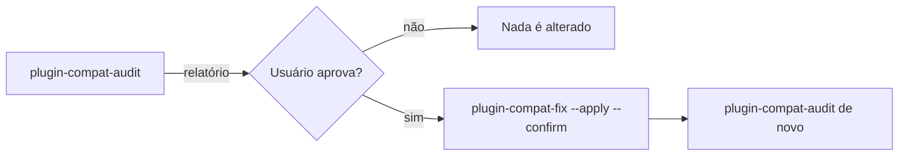

# cross-compatible-plugin

Skills que auditam e corrigem um plugin de agente para que **um único repositório, sem código duplicado (DRY)**, funcione no GitHub Copilot CLI, no VS Code (agent plugins), no Claude Code e no OpenAI Codex.

## Instalação

Clique no botão abaixo correspondente a sua edição do VS Code e confirme o prompt de instalação no editor.

[](vscode://chat-plugin/install?source=andrefontourainvillia/cross-compatible-plugin)

[](vscode-insiders://chat-plugin/install?source=andrefontourainvillia/cross-compatible-plugin)

## Como o plugin se comporta

O fluxo tem quatro etapas e nunca altera arquivos sem aprovação explícita:



1. **Auditoria** (`plugin-compat-audit`): roda os três validadores e grava `.compat-report.json`.
2. **Relatório**: o agente mostra os findings por gravidade (`error`, `warning`, `info`) e as correções propostas.
3. **Aprovação**: o agente mostra o dry-run da correção e espera um "sim" explícito.
4. **Correção** (`plugin-compat-fix`): move os arquivos para a fonte canônica, cria links relativos por arquivo e roda a auditoria de novo.

## Skills

| Skill | Função | Altera arquivos? |
|---|---|---|
| `plugin-compat-audit` | Orquestra os validadores e consolida o relatório | Não (só grava o relatório) |
| `validate-manifest` | `plugin.json` e `mcp.json` contra o Agent Plugins 1.0 | Não |
| `validate-links` | Links por arquivo, duplicatas, links quebrados, absolutos ou para fora da raiz | Não |
| `validate-components` | Frontmatter de agentes, nomes de skills, eventos de hooks, arquivos de instruções | Não |
| `plugin-compat-fix` | Aplica `move`, `link` e `replace-identical` do relatório | Sim, com `--apply --confirm` |
| `readme-install-badge` | Adiciona os botões de instalação no README | Sim, com `--apply` |

Todas as regras ficam em [lib/compat-rules.mjs](lib/compat-rules.mjs), e o formato do relatório em [lib/report.mjs](lib/report.mjs).

## Estrutura que o plugin valida

Cada conteúdo tem uma fonte canônica (arquivo real). Os outros clientes chegam a ela por symlinks relativos, **um por arquivo**:

| Fonte canônica (real) | Link | Lido por |
|---|---|---|
| `plugin.json` | `.claude-plugin/plugin.json` | Claude Code |
| `plugin.json` | `.codex-plugin/plugin.json` | Codex |
| `mcp.json` | `.mcp.json` | Claude Code |
| `agents/<nome>.agent.md` | `com.github.copilot/agents/<nome>.agent.md` | Copilot CLI, VS Code |
| `commands/<nome>.md` | `com.github.copilot/commands/<nome>.md` | Copilot CLI, VS Code |
| `hooks/hooks.json` | `com.github.copilot/hooks/hooks.json` | Copilot CLI, VS Code |
| `skills/<nome>/SKILL.md` | (sem link) | Todos |

Regras de compatibilidade aplicadas:

- **Manifesto**: `plugin.json` usa `$schema` Agent Plugins 1.0 e só os campos permitidos. O Claude ignora o `$schema`, e o Codex usa `name`, `version` e `description`.
- **MCP**: `type` explícito (`stdio`, `streamable-http`, `sse`). `.mcp.json` só vira link se não houver `${PLUGIN_ROOT}` nem `${CLAUDE_PLUGIN_ROOT}`, porque cada cliente só expande o próprio token.
- **Hooks**: formato do Claude (PascalCase + `matcher`), apenas com os eventos comuns: `SessionStart`, `UserPromptSubmit`, `PreToolUse`, `PostToolUse`, `PreCompact`, `SubagentStart`, `SubagentStop`, `Stop`. O VS Code ignora `matcher`, então filtre também dentro do script.
- **Agentes**: `name` no frontmatter é obrigatório e igual ao nome do arquivo. Sem ele, o Claude nomeia o agente `<id>.agent`.
- **Skills**: `name` igual ao nome da pasta, em kebab-case.
- **Instruções**: `CLAUDE.md` e `AGENTS.md` na raiz do plugin não são carregados por nenhum cliente. Use uma skill.
- **Removido**: `.plugin/plugin.json`, o formato OpenPlugin legado, que conflita com o 1.0.

## Guardrails

1. **Nenhuma alteração sem o OK explícito do usuário.** Os scripts de correção rodam em dry-run por padrão. `plugin-compat-fix` exige `--apply --confirm`.
2. **Nunca sobrescreve e nunca apaga arquivos divergentes.** Conflitos são reportados (código 5). Duplicatas byte a byte idênticas só viram link com `--replace-identical`.
3. **Links sempre relativos, por arquivo e dentro da raiz do plugin.** Links de pasta, absolutos ou que saem da raiz são erros.
4. **Recusa cópias instaladas ou em cache** (`~/.vscode*/agent-plugins`, `~/.copilot/installed-plugins`, `~/.claude/plugins/cache`, …): código 4. A auditoria dessas cópias é permitida, com aviso.
5. **Revalida antes de agir.** A correção confere o estado atual de cada caminho, então um relatório desatualizado não causa estragos.
6. **Sem rede e sem prompts interativos.** JSON no stdout, diagnósticos no stderr, `--help` em todos os scripts.
7. **Pode rodar várias vezes.** Uma segunda execução não faz nada.

### Códigos de saída

| Código | Significado |
|---|---|
| 0 | OK |
| 1 | Há findings com gravidade `error` |
| 2 | Argumento inválido (ex.: `--apply` sem `--confirm`) |
| 3 | Raiz, `plugin.json`, relatório ou README não encontrado |
| 4 | Caminho recusado (cópia instalada ou cache) |
| 5 | Conflito: ações puladas para não sobrescrever |

## Uso rápido

```bash
node skills/plugin-compat-audit/scripts/aggregate.mjs --root ../meu-plugin
node skills/plugin-compat-fix/scripts/fix.mjs --report ../meu-plugin/.compat-report.json
node skills/plugin-compat-fix/scripts/fix.mjs --report ../meu-plugin/.compat-report.json --apply --confirm
node skills/readme-install-badge/scripts/add-badge.mjs --root ../meu-plugin --apply
```

Requisitos: Node.js 18+. O git é opcional (usado para `git mv` e para detectar `core.symlinks`).

## Limitações conhecidas

- **`tools` no frontmatter**: nomes como `vscode/memory` são do VS Code/Copilot. No Claude Code, `tools` funciona como allowlist, então o agente pode perder ferramentas. A skill avisa, mas não corrige.
- **Codex**: não lê `agents/*.md` (usa TOML próprio). Manifesto e skills funcionam.
- **Symlinks não documentados**: nenhuma documentação cobre como o Codex trata um manifesto por link, nem como o Copilot e o VS Code tratam links ao instalar via git. Valide com uma instalação real.
- **Windows**: com `core.symlinks=false`, os links viram arquivos de texto (`validate-links` avisa).
- **LSP**: os formatos diferem por cliente, então este plugin não tenta unificá-los.

## Desenvolvimento

```bash
node --test tests/*.test.mjs
```

## Fontes

- [Agent Plugins Specification 1.0.0](https://github.com/agentplugins/agent-plugins-spec/blob/main/spec/1.0.0.md) e [mcp.schema.json](https://agent-plugins.org/schemas/1.0.0/mcp.schema.json)
- [Agent Skills specification](https://agentskills.io/specification) e [Using scripts in skills](https://agentskills.io/skill-creation/using-scripts)
- [GitHub Copilot CLI plugin reference](https://docs.github.com/en/copilot/reference/copilot-cli-reference/cli-plugin-reference) e [hooks reference](https://docs.github.com/en/copilot/reference/hooks-reference)
- [VS Code agent plugins](https://code.visualstudio.com/docs/agent-customization/agent-plugins)
- [Claude Code plugins](https://code.claude.com/docs/en/plugins/manifest-reference)
- [OpenAI Codex plugins](https://developers.openai.com/codex/plugins/)
